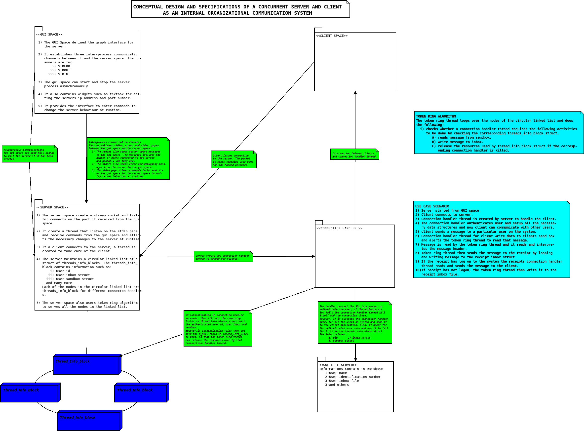
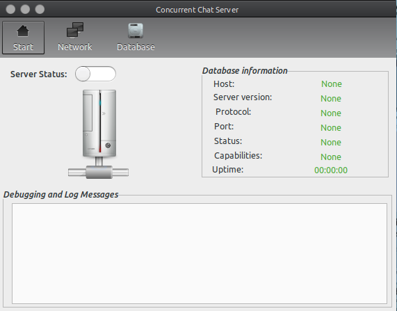
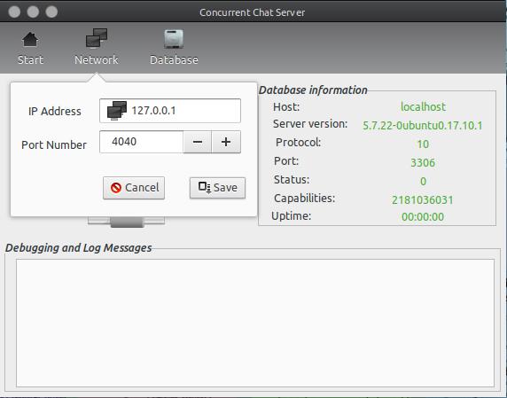
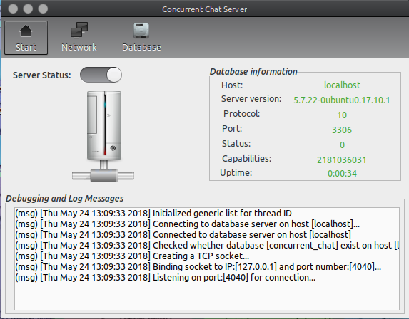
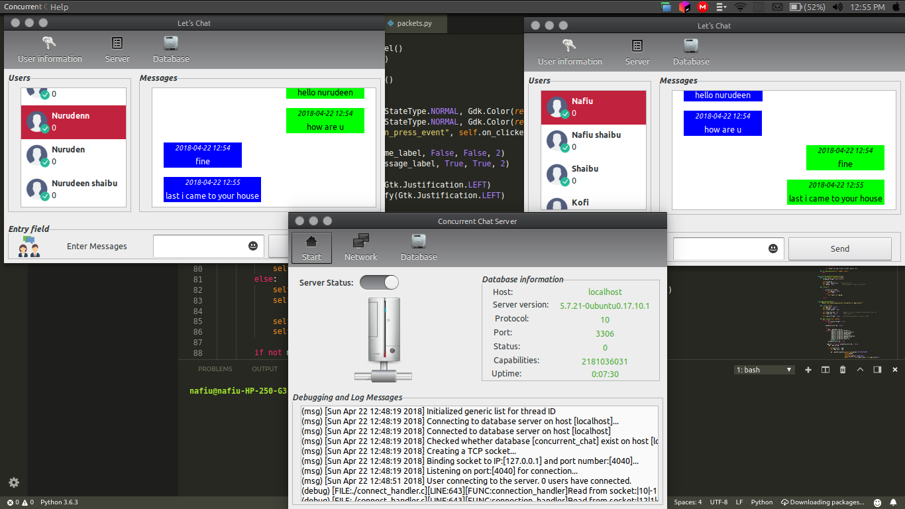

# Concurrent-Server
This is the server codebase for the *iCOM* system. *iCOM* is an internal communication system 
that is designed to service the communication needs of organizations through the use of a 
concurrent server which runs on any unix-like system and a client that can be run on any 
other operating system used by the organization. 


## Setup
#### Python Prerequisites
* Python 3+
* pymysql
* GTK+3 python wrapper
```
sudo apt install python3-gi python3-gi-cairo gir1.2-gtk-3.0
```
#### C Prerequisites
* Pthread
* MySQL-Lib

I have not added python setup yet. So to buid and run the application:
```
$ cd Concurrent-Server
$ make
$ cd gui
$ ./main.py
```

## Starting Server
The server requires to connect to MySQL database server before it can start. Hence, to configure the connection to the database server. The user has to click on the database tool button of the server. This displays a popover menu requesting the user to enter the hostname, user password, and the username as shown in Figure below.


The server is given an IP address and port number to listen on by clicking on the Network tool button. This also displays a popover menu for configuration as shown in Figure below.


After configuring the database and giving the server an IP address and port number. The server can now be started by clicking the start tool button. This is shown in Figure below.


## In Action

